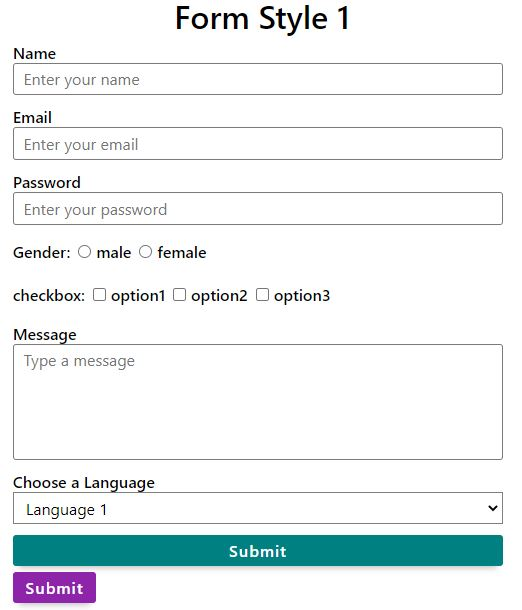
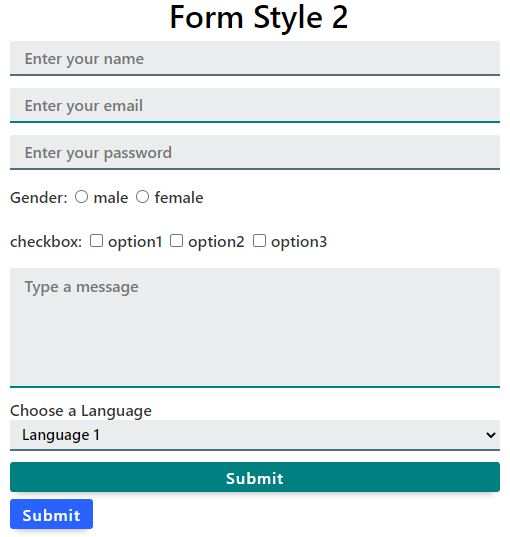

## CSS Forms
* CDN: 
### Note
* All the input fields, labels, buttons should we wrapped inside div with a class **'form-group'** or **'form-inline-group'** based on the usecase
* forms should given a class of **'form'**

### Form Style 1
This has a simple Styling.
* All the input type has a class name of **'input'**
* Label have a class name of **'label'**
* select element has a class name of **'select'**
   

### Form Style 2
This has a Modern Styling.
* All the input type has a class name of **'input-2'**
* Label have a class name of **'label-2'**
* select element has a class name of **'select-2'**
   

### Inline Forms
* Inline form elements has to wrapped inside a div having class name as **'form-inline-group'**
   
  

### Buttons
* Buttons have a class of **'btn'**
* To make a Button to take full width wrap it inside a **'form-group'**
* To change background color add one these class along with **'btn'**
    * **'btn-blue'**
    * **'btn-pink'**
    * **'btn-purple'**
    * **'btn-grey'**
    * **'btn-success'** 
    * **'btn-danger'** 
    * **'btn-warning'** 
   
 

* To change sizeof button add one these class along with **'btn'**
    * **'btn-sm'**
    * **'btn-lg'**
   
 

